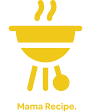

<div id="top"></div>
<p align="center">
  <a href="https://github.com/altrawan/mama-recipe-app">
    
  </a>
</p>
<h3 align="center">Mama Recipe</h3>
<p align="center">
  Discover Recipe & Delicious Food.
  <br/>
  <a href="#table-of-contents">
    <strong>Explore the docs »</strong>
  </a>
  <br /><br/>
  <a href="https://bit.ly/mama-recipe-app">View Demo</a>
  ·
  <a href="https://github.com/altrawan/mama-recipe-app/issues">Report Bug</a>
  ·
  <a href="https://github.com/altrawan/mama-recipe-app">Request Feature</a>
</p>
<p align="center">
  <a href="https://reactjs.org/">
    
  </a>
  <a href="https://getbootstrap.com/docs/5.1/getting-started/introduction/">
    
  </a>                                     
</p>

<!-- TABLE OF CONTENTS -->
 ## Table of Contents

* [About the Project](#about-the-project)
  * [Built With](#built-with)
* [Getting Started](#getting-started)
  * [Prerequisites](#prerequisites)
  * [Installation](#installation)
  * [Setup .env](#setup-env)
* [Screenshots](#screenshoots)
* [Related Project](#related-project)
* [Contact](#contact)
* [License](#license)

<!-- ABOUT THE PROJECT -->
## About The Project
Mama Recipe is here to help you cook delicious and simple meals. We offer recipes and cooking advice for home cooks, by home cooks. Mama Recipe is a web-based recipe sharing that applicaion that allow user to share their recipe, liked, and comment. Just like social media. In this app, user could take a look into recipe including it's ingredients and video step.

### Built With
This app was built with some technologies below:
* [CSS](https://developer.mozilla.org/en-US/docs/Web/CSS?retiredLocale=id)
* [Javascript](https://www.javascript.com/)
* [React](https://vuejs.org/v2)
* [Axios](https://axios-http.com/)
* [React Redux](https://react-redux.js.org/introduction/getting-started)
* [Bootstrap](https://getbootstrap.com/)
* [Reactstrap](https://reactstrap.github.io/)

<p align="right">(<a href="#top">back to top</a>)</p>

<!-- GETTING STARTED -->
## Getting Started

### Prerequisites

Before going to the installation stage there are some software that must be installed first.

* [NodeJs](https://nodejs.org/en/download/)

<p align="right">(<a href="#top">back to top</a>)</p>

### Installation

If you want to run this project locally, We recommend you to configure the [back-end](https://github.com/altrawan/food-recipe-api) first before configuring this repo front-end.
- Clone the repo
```
git clone https://github.com/altrawan/mama-recipe-app.git
```
- Go To Folder Repo
```
cd mama-recipe-app
```
- Install Module
```
npm install
```
- <a href="#setup-env">Setup .env</a>
- Type ` npm run dev` To Start Website
- Type ` npm run start` To Start Production

<p align="right">(<a href="#top">back to top</a>)</p>

### Setup .env
Create .env file in your root project folder.
```
REACT_APP_DEV=[BACKEND_URL_DEVELOPMENT]
REACT_APP_PROD=[BACKEND_URL_PRODUCTION]
REACT_APP_STAGING=[dev / prod]
```

<p align="right">(<a href="#top">back to top</a>)</p>

## Screenshoots
<details>
  <summary>
    Landing Page
  </summary>

</details>

<details>
  <summary>
    Login Page
  </summary>

</details>

<details>
  <summary>
    Register Page
  </summary>

</details>

<details>
  <summary>
    Forgot Password Page
  </summary>

</details>

<details>
  <summary>
    Reset Password Page
  </summary>

</details>

<details>
  <summary>
    Detail Recipe Page
  </summary>

</details>

<details>
  <summary>
    Detail Video Page
  </summary>

</details>

<details>
  <summary>
    View Recipe Page
  </summary>

</details>

<details>
  <summary>
    Add Recipe Page
  </summary>

</details>

<details>
  <summary>
    Profile Page
  </summary>

</details>

<details>
  <summary>
    Edit Profile Page
  </summary>

</details>

<details>
  <summary>
    Change Password Page
  </summary>

</details>

<p align="right">(<a href="#top">back to top</a>)</p>

## Contributing

Contributions are what make the open source community such an amazing place to be learn, inspire, and create. Any contributions you make are **greatly appreciated**.

1. Fork the Project
2. Create your Feature Branch (`git checkout -b feature/AmazingFeature`)
3. Commit your Changes (`git commit -m 'Add some AmazingFeature'`)
4. Push to the Branch (`git push origin feature/AmazingFeature`)
5. Open a Pull Request

<p align="right">(<a href="#top">back to top</a>)</p>

## Related Project
:rocket: [`Backend Mama Recipe`](https://github.com/aryairama/zwallet-express)

:rocket: [`Frontend Mama Recipe`](https://github.com/altrawan/mama-recipe-app)

:rocket: [`Demo Mama Recipe`](https://bit.ly/mama-recipe-app)

<p align="right">(<a href="#top">back to top</a>)</p>

## Contact

My Email : muhammadalifputra8888@gmail.com

Project Link: [https://github.com/altrawan/mama-recipe-app](https://github.com/altrawan/mama-recipe-app)

<p align="right">(<a href="#top">back to top</a>)</p>

## License
Distributed under the [MIT](/LICENSE) License.

<p align="right">(<a href="#top">back to top</a>)</p>
